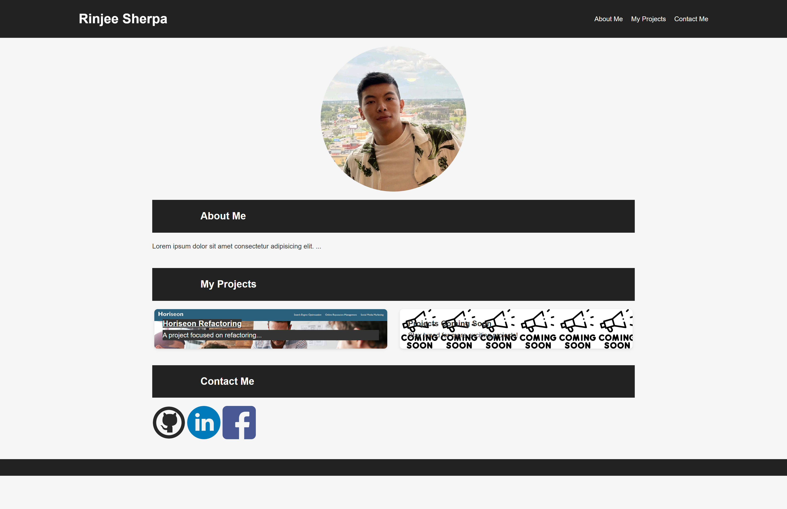

# Rinjee's Portfolio

Welcome to my portfolio on GitHub! Here, you'll find projects showcasing my skills and interests in web development. Feel free to explore and reach out if you have any questions or collaboration ideas.

## About Me

I'm Rinjee Sherpa, a passionate web developer with a focus on creating engaging and accessible web applications. Through my projects, I aim to demonstrate my skills in HTML, CSS, JavaScript, and other web technologies.

## Projects

Here are some of the projects I've worked on:

- **Horiseon Refactoring**: A project focused on improving the accessibility and search engine optimization of an existing website. Check it out [here](https://rinjeeg.github.io/Horiseon-Refactoring/).

- **Projects Coming Soon**: Stay tuned for more projects that I am currently working on. I'm always exploring new technologies and adding new projects to my portfolio.

## Contact Me

Let's connect! You can find me on:

- GitHub: https://github.com/RinjeeG 
- LinkedIn: https://www.linkedin.com/in/rinjee-sherpa-13b38b275/
- Email: rinjigelu39@gmail.com

Feel free to reach out for collaborations or just to say hi!

## Acknowledgments
https://www.w3schools.com/
https://developer.mozilla.org/en-US/
https://chat.openai.com/?model=gpt-4
https://bootcampspot.instructure.com/courses/5271/external_tools/313

Thank you for visiting my portfolio. I look forward to connecting with you!

## screenshots

